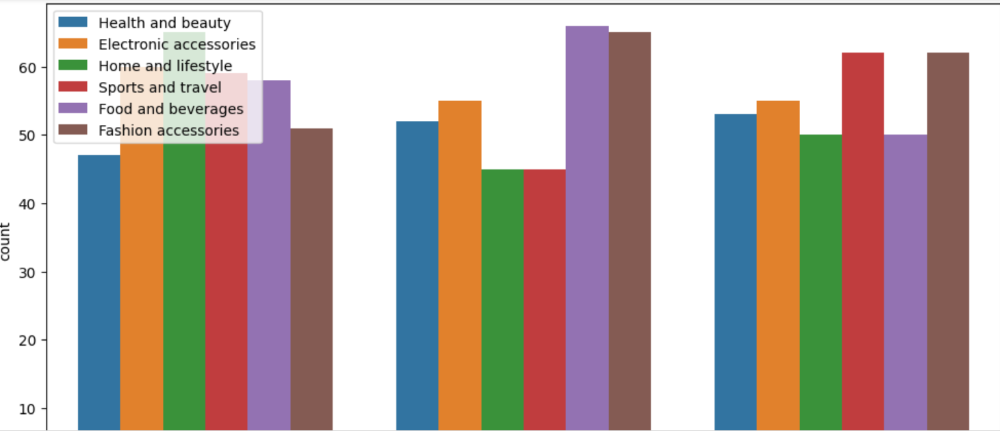

<!--Section 1: Introduce your self-->
## ABOUT ME  
Hello! I'm Samuel Orija 🤓, a result-driven Data Analyst with a strong background in transforming complex datasets into actionable business insights. Adept at leveraging SQL, Python, Power BI, and Excel to analyze trends, optimize operations, and drive strategic decision-making. Passionate about data storytelling, problem-solving and improving business performance.
<!--Mention your top/relevant skills here - core and soft skills-->
## SKILLS

*As the Chief Analyst of thebestmrsam_analytics, I provide consulting and training services for businesses and mentor aspiring analysts.*

- ✅ **Data Analysis & Visualization:**  
  Proficient in Power BI, Tableau, Excel, Matplotlib, Seaborn to optimize processes that drive business growth.
- ✅ **Programming & Querying:**
  SQL, Python for data wrangling and data visualization  
- ✅ **Business Intelligence & Data Modeling**  
- ✅ **Statistical Analysis & Reporting:**
  A/B Testing and Predictive Analytics 
  ✅ **Data Analytics Coach, Content Creator, Consultant**
  I offer comprehensive training programs in data analysis, visualization, and data-driven decision-making.
- ✅ **Communication, Collaboration, Data Storytelling and Writing**

<!--Section 2: List 3-4 key projects-->
## MY PROJECTS

*A glimpse of some of the projects I've worked on and those I am currently working on.*

**How I Built A Predictive Model For Loan Eligibility For A Fintech Bank Using Zion Tech Hub Dataset.**  
*In a financial landscape where loans fuel aspirations, a comprehensive analysis of bank loans and eligibility, revealing patterns that facilitate smarter financial decision-making, is critical. I designed a model that helps Fintech banks track customers eligibility and reduced default risk.*

[Read More](https://www.linkedin.com/posts/orijasamuel_t-activity-7275863136954384384-ffQ1?utm_source=share&utm_medium=member_desktop&rcm=ACoAADGPmyoBP03lpKukRgS3z7IZvbBb_VRlHLI)

**Road Accident Analysis**  
*In this analysis, I explored the impact of data-driven insights on Road accidents, using Power BI. From identifying high-risk areas to enhancing road infrastructure that improves road safety.*

[Read More](https://www.linkedin.com/posts/orijasamuel_dataanalytics-powerbi-road-activity-7185767563774062593-lWO2?utm_source=share&utm_medium=member_desktop&rcm=ACoAADGPmyoBP03lpKukRgS3z7IZvbBb_VRlHLI)

**A Data-Driven Approach To Enhancing Hospital Care And Efficiency**  
*This is a comprehensive analysis report of patient data from Faith Specialist Hospital, whose objective is to uncover actionable insights to improve patient care and address operational challenges. Using PostgresSQL and Excel, I uncovered key insights and actionable recommendations that  has the capacity of revolutionizing the healthcare sector.*  
  
[Download the Report here (pdf file)](https://drive.google.com/file/d/1SoxmennvwTZ_2BRwO7MdhsTdYVYJ3W5y/view?usp=drive_link)

**Electric Vehicle Analysis**  
This analysis explore the need for the expansion of the adoption of Electric vehicles, detailing their environmental impacts and safety features.

[Read More](https://www.linkedin.com/posts/orijasamuel_dataanalysis-visualization-insights-activity-7178925902028828672-V23D?utm_source=share&utm_medium=member_desktop&rcm=ACoAADGPmyoBP03lpKukRgS3z7IZvbBb_VRlHLI)

**Exploratory Data Analysis Using Python.**  
*There are secrets hidden in most data, to richly maximize them, I performed a thorough explorstory data analysis using python to uncover great insights that foster increase revenue generation by measurable increases.*
   
[Read More](https://colab.research.google.com/drive/1q5nr7Xa7qtiIDcoR-gac92cWzzZF5-IV?usp=drive_link)

**Coffee Shop Sales Analysis Report Using Power BI.**  
In this project, I cleaned and demonstrated an in-depth analysis of Coffee Shop Sales, leveraged advanced data visualization techniques to unravel key insights and trends, providing valuable business intelligence for strategic decision-making.

[View Project Engagement](https://www.linkedin.com/posts/orijasamuel_dataanalysis-businessintelligence-coffeeshopsales-activity-7204005140192731136-j07G?utm_source=share&utm_medium=member_desktop&rcm=ACoAADGPmyoBP03lpKukRgS3z7IZvbBb_VRlHLI)

## CONTACT DETAILS

*Let’s connect, collaborate and transform the world together, using the power of data and analytics to drive great transformation!*
<table>
  <tbody>
    <tr>
      <td>📧</td>
      <td><a href="mailto:adewunmisamuel2018@gmail.com">adewunmisamuel2018@gmail.com</a></td>
    </tr>
    <tr>
      <td>📞</td>
      <td>(234) 810-142-9661</td>
    </tr>
    <tr>
      <td>📍</td>
      <td>Lagos, Nigeria</td>
    </tr>
    <tr>
      <td>⬇️</td>
      <td><a href="https://drive.google.com/file/d/1EZSHKcrY1x7QF6DRLaCt8lc-6J7RBcDi/view?usp=drive_link">Download my CV</a></td>
    </tr>
    <tr>
      <td>🌐</td>
      <td><a href="https://www.linkedin.com/in/orijasamuel/">My daily activities on LinkedIn</a></td>
    </tr>
    <tr>
      <td>📺</td>
      <td><a href="https://youtube.com/@thebestmrsam?si=n8aXOY0oas3OqJFr">Watch my tutorials on YouTube</a></td>
    </tr>
  </tbody>
</table>
<!-- TikTok Row -->
<tr>
  <td>
    
  </td>
  <td>
    <a href="https://www.tiktok.com/@thebestmrsam_analytics?_t=ZM-8uckqkVaMAn&_r=1">Watch My Daily Activities On TikTok</a>
  </td>
</tr>

<!-- Facebook Row -->
<tr>
  <td>
    
  </td>
  <td>
    <a href="https://www.facebook.com/share/15nnRmVGNN/" target="_blank">Watch My Daily Activities On Facebook</a>
  </td>
</tr>

<a href="17 How to Present Data to Executives by Anietie Etuk.pdf">Download the Report here (pdf file)</a>
