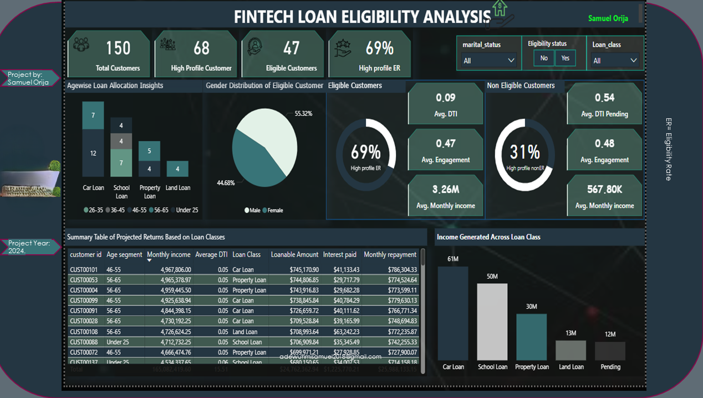
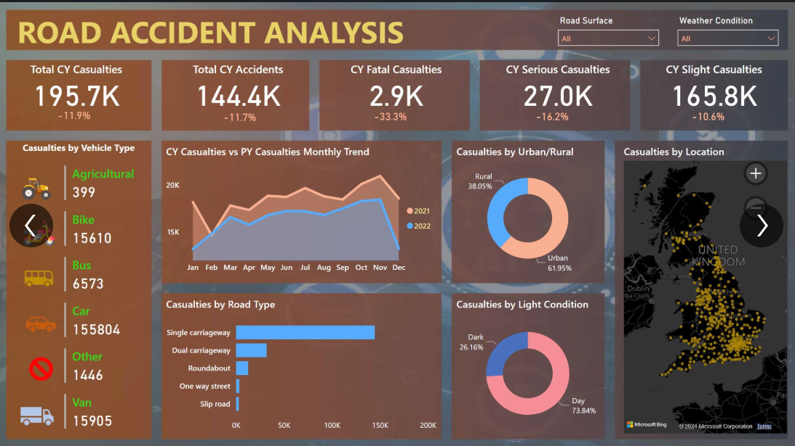
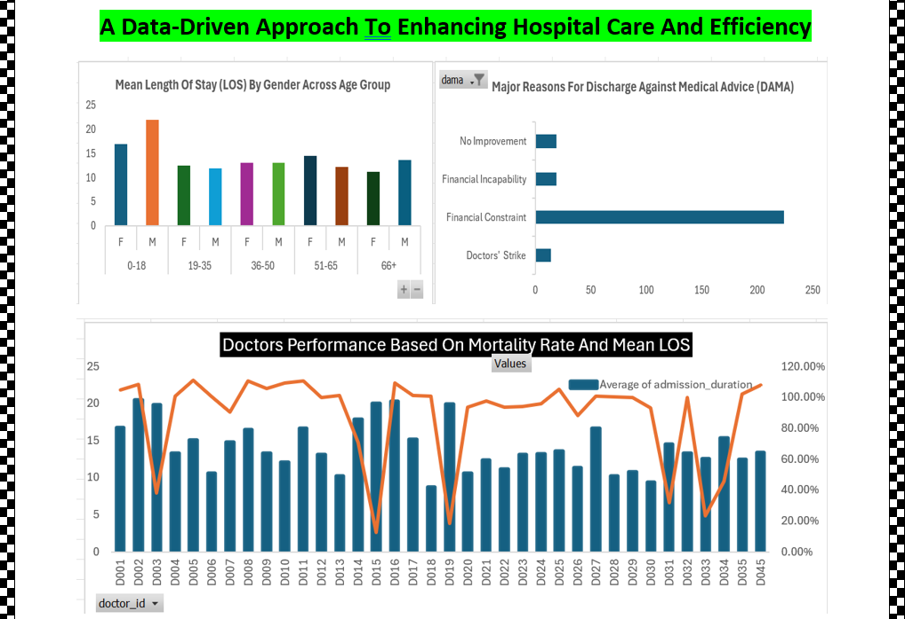
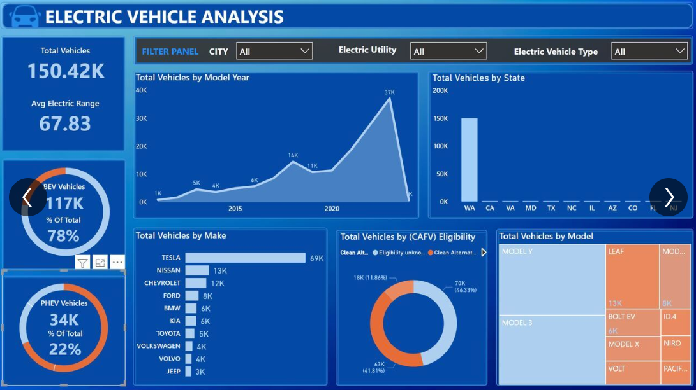

<!--Section 1: Introduce your self-->
## ABOUT ME

Hello! I'm Samuel Orija 🤓, a data analyst, educator, and consultant with a passion for turning data into actionable insights. Utilizing design thinking to develop client-centric solutions in form of reports, dashboards, and presentations to help businesses solve challenges and unlock growth.

<!--Mention your top/relevant skills here - core and soft skills-->
## SKILLS

*As the Chief Analyst of thebestmrsam_analytics, I provide consulting and training services for businesses and mentor aspiring analysts.*

- ✅ **Data Cleaning And Transformation**  
  I ensure data quality by standardizing data formats and optimizing processes that drive business growth.
- ✅ **Data Wrangling Data Visualization**  
  I transform and prepare raw data into a format that is suitable for analysis and visualization.
- ✅ **Data Analytics Coach**  
  I offer comprehensive training programs in data analysis, visualization, and data-driven decision-making.
- ✅ **Data Storytelling**
  Present reports of analysis in manners in which a technical and non-technical stakeholders can understand, and ensure that the business needs is adressed.
- ✅ **SQL, Excel, Power BI**

<!--Section 2: List 3-4 key projects-->
## MY PROJECTS

*A glimpse of some of the projects I've worked on and those I am currently working on.*

**How I Built A Predictive Model For Loan Eligibility For A Fintech Bank Using Zion Tech Hub Dataset.**  
*In a financial landscape where loans fuel aspirations, a comprehensive analysis of bank loans and eligibility, revealing patterns that facilitate smarter financial decision-making, is critical. I designed a model that helps Fintech banks track customers eligibility and reduced default risk.*

[Read More](https://www.linkedin.com/posts/orijasamuel_t-activity-7275863136954384384-ffQ1?utm_source=share&utm_medium=member_desktop&rcm=ACoAADGPmyoBP03lpKukRgS3z7IZvbBb_VRlHLI)

**Road Accident Analysis**  
*In this analysis, I explored the impact of data-driven insights on Road accidents, using Power BI. From identifying high-risk areas to enhancing road infrastructure that improves road safety.*

[Read More](https://www.linkedin.com/posts/orijasamuel_dataanalytics-powerbi-road-activity-7185767563774062593-lWO2?utm_source=share&utm_medium=member_desktop&rcm=ACoAADGPmyoBP03lpKukRgS3z7IZvbBb_VRlHLI)
The sinking of the Titanic is one of the most infamous shipwrecks in history.

**A Data-Driven Approach To Enhancing Hospital Care And Efficiency**  
*This is a comprehensive analysis report of patient data from Faith Specialist Hospital, whose objective is to uncover actionable insights to improve patient care and address operational challenges. Using PostgresSQL and Excel, I uncovered key insights and actionable recommendations that  has the capacity of revolutionizing the healthcare sector.*  
  
[Read More](https://drive.google.com/file/d/1SoxmennvwTZ_2BRwO7MdhsTdYVYJ3W5y/view?usp=drive_link)

**Electric Vehicle Analysis**
This analysis explore the need for the expansion of the adoption of Electric vehicles, detailing their environmental impacts and safety features.

[Read More](https://www.linkedin.com/posts/orijasamuel_dataanalysis-visualization-insights-activity-7178925902028828672-V23D?utm_source=share&utm_medium=member_desktop&rcm=ACoAADGPmyoBP03lpKukRgS3z7IZvbBb_VRlHLI)

**Predictive Modeling and Hypothesis Testing using Titanic Dataset.**

On April 15, 1912, during her maiden voyage, the widely considered “unsinkable” RMS Titanic sank after colliding with an iceberg. 

[Read More](https://www.linkedin.com/pulse/predictive-modeling-hypothesis-testing-using-titanic-dataset-anietie/)

**Predictive Modeling and Hypothesis Testing using Titanic Dataset.**

Unfortunately, there weren’t enough lifeboats for everyone onboard, resulting in the death of 1502 out of 2224 passengers and crew. 

<a href="17 How to Present Data to Executives by Anietie Etuk.pdf">Download the Report here (pdf file)</a>

## CONTACT DETAILS

*Let’s connect and see how we can make a difference together!*
<table>
  <tbody>
    <tr>
      <td>📧</td>
      <td><a href="mailto:anietieetuk@gmail.com">anietieetuk@gmail.com</a></td>
    </tr>
    <tr>
      <td>📞</td>
      <td>(234) 816-763-7212</td>
    </tr>
    <tr>
      <td>📍</td>
      <td>PH, Nigeria</td>
    </tr>
    <tr>
      <td>⬇️</td>
      <td><a href="https://etuk123456.github.io/portfolio1/docs/Profile.pdf">Download my CV</a></td>
    </tr>
    <tr>
      <td>🌐</td>
      <td><a href="https://linkedin.com/in/etukanietie">The things I do daily on LinkedIn</a></td>
    </tr>
    <tr>
      <td>📺</td>
      <td><a href="https://www.youtube.com/@LearnwithEtuk">Watch my tutorials on YouTube</a></td>
    </tr>
  </tbody>
</table>
